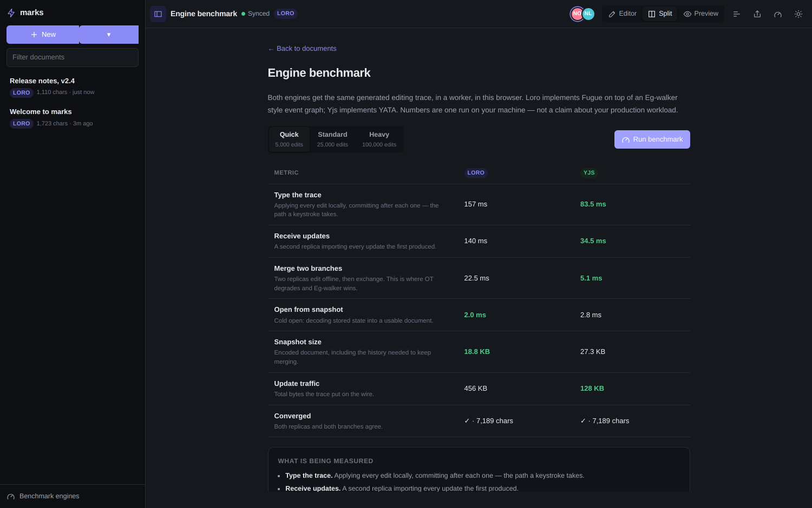

# marks

Collaborative markdown editing that stays responsive at any document size.

A HackMD-style split editor — source on the left, live preview on the right —
where every keystroke lands in a local CRDT replica first, and the preview
repaints only the blocks you actually changed.


## Why it feels different

Most markdown editors debounce the preview and re-render the whole document.
That is fine for a page of notes and miserable for a long one. marks takes the
work apart:

| | Typical markdown editor | marks |
| --- | --- | --- |
| Preview | debounce, then re-render everything | per-block content hash, only dirty blocks repaint |
| Parsing | on the main thread, blocking input | in a Web Worker |
| Off-screen content | laid out and painted | skipped via `content-visibility` |
| Merging | operational transform, server-ordered | CRDT, converges without a server |
| Opening a document | replay the edit history | one snapshot over cacheable HTTP |
| Performance claims | none | a panel in the app, and a benchmark you can run |

The result on a 53 KB, 757-block document, typing in the middle of it:

```
edit → preview painted     p50 55 ms · p95 114 ms
blocks re-rendered         1 of 757
DOM operations             3
```

Typing itself never waits on any of that — the editor and the CRDT are on the
main thread, the markdown parser is not.

## Running it

```bash
npm install
npm run dev          # server on :3000, client on :5173
```

Then open http://localhost:5173. For a production build:

```bash
npm run build
npm start            # serves the built client and the sync server on :3000
```

Open the same document URL in two windows to see collaboration.

### Environment

| Variable | Default | Purpose |
| --- | --- | --- |
| `PORT` | `3000` | HTTP and WebSocket port |
| `HOST` | `0.0.0.0` | Bind address |
| `MARKS_DATA_DIR` | `./data` | Where the SQLite database lives |
| `MARKS_DB` | `$MARKS_DATA_DIR/marks.sqlite` | Database path |
| `MARKS_PERSIST_DEBOUNCE` | `1500` | Idle milliseconds before a snapshot is written |
| `MARKS_PERSIST_MAX_WAIT` | `10000` | Longest a stream of edits can defer a write |
| `MARKS_ROOM_IDLE` | `60000` | How long an empty room stays in memory |

## Editing

Everything you would expect from a markdown editor, plus what HackMD taught
people to expect:

- **Split, editor-only and preview-only** modes (`Ctrl`/`Cmd` + `\` cycles them)
- **Synchronised scrolling** mapped by source line, not by percentage
- **Formatting toolbar** and shortcuts — bold, italic, strikethrough, highlight,
  headings, links, lists, task lists, quotes, tables, code blocks
- **Live outline** built from the document's headings (`Ctrl`/`Cmd` + `Shift` + `O`)
- **Clickable task lists** — ticking a box in the preview edits the source
- **Tables, footnotes, definition lists, abbreviations, sub/sup, marks, emoji**
- **Math** via KaTeX, **diagrams** via Mermaid, **syntax highlighting** via highlight.js
- **Callouts** — `:::info`, `:::success`, `:::warning`, `:::danger`, `:::note`
- **Presence**: avatars, live remote cursors and selections
- **Per-user undo** — undoing reverts your edits, never a collaborator's
- **Offline editing**, with local persistence, multi-tab replica sync, and automatic resync
- **Comments** anchored to a source range, stored on the same CRDT as the markdown
- **Voice input** where the browser exposes SpeechRecognition
- **Document-scoped copy / paste / select-all / right-click**, including HTML→markdown paste
- **Light and dark themes**, and a layout that works on a phone
- **Export** to `.md`, and a share link that is just the URL

## Architecture

```
client/                     Vite + React + TypeScript
  browser/                  clipboard, context menu, voice, comments, tab sync, cache
  collab/                   CollabSession interface, Loro and Yjs engines
  markdown/                 markdown-it setup, block diffing, DOM patching
  workers/                  markdown.worker.ts, bench.worker.ts
  editor/                   CodeMirror 6 setup, commands, theme
  components/ pages/        UI
server/                     Express + ws + SQLite
  loro-room.ts              in-memory Loro replica per document
  yjs-room.ts               Hocuspocus, bridged onto the same HTTP server
  store.ts api.ts           persistence and REST
```

### The rendering path

1. A keystroke applies to the local CRDT replica and paints in CodeMirror. No
   network, no worker, no wait.
2. The new text goes to the markdown worker. It parses the **whole** document —
   link references and footnotes are document-wide, so partial parsing would be
   wrong — but renders only the blocks whose source hash changed.
3. The worker returns HTML **only for blocks the main thread does not already
   have**. A one-word edit in a 700-block document ships a few hundred bytes.
4. The main thread sanitises those blocks and reconciles them into the DOM by
   key. Unchanged blocks keep their exact nodes, so their layout, their rendered
   diagrams and any text selection inside them survive.

Block keys are content hashes plus an occurrence counter, so inserting a
paragraph at the top of a document does not invalidate everything below it.

### Two CRDT engines

Documents are stored in one of two CRDTs, chosen when the document is created.
Both implement the same `CollabSession` interface, so nothing above that layer
knows which is in use.

- **[Loro](https://loro.dev)** (default) — Fugue over an Eg-walker style event
  graph. Smaller encoded documents and faster cold opens.
- **[Yjs](https://yjs.dev)** — YATA, served by
  [Hocuspocus](https://tiptap.dev/docs/hocuspocus). The widest ecosystem of
  bindings and backends if you need to integrate with something else.

They trade places depending on what you measure, and the app will tell you
which: **Benchmark engines** in the sidebar runs an identical editing trace
against both, in a worker, in your browser.



One run of the 25,000-edit trace in headless Chromium (your numbers will
differ):

| | Loro | Yjs |
| --- | --- | --- |
| Type the trace | 157 ms | **83 ms** |
| Receive updates | 140 ms | **35 ms** |
| Merge two branches | 22.5 ms | **5.1 ms** |
| Open from snapshot | **2.0 ms** | 2.8 ms |
| Snapshot size | **18.8 KB** | 27.3 KB |
| Update traffic | 456 KB | **128 KB** |

Yjs applies a long trace of single-character edits with less overhead — it is
pure JavaScript, while Loro crosses the WebAssembly boundary on every keystroke.
Loro wins on stored size and cold-open time, which is what decides how fast a
document appears when you click it. At human typing speed the per-operation
difference (6 µs versus 3 µs) is invisible; the snapshot difference is not.

### Sync protocol

Loro rooms speak a small binary protocol over one WebSocket per document — a
tag byte plus a payload. Clients announce the version vector they already hold
in the connection URL, so a reconnect or a warm open costs a delta rather than a
snapshot. The server is a full replica rather than a relay, which is what lets
it answer a cold open with a single snapshot instead of a replay of history.

Yjs rooms are served by Hocuspocus, which multiplexes every document over one
socket and carries the document name in its own sync protocol.

Both persist to the same SQLite table, and both derive the document title from
its first heading server-side, so every client agrees on it without extra
coordination.

## Performance panel

`Ctrl`/`Cmd` + `Shift` + `M` opens a live readout: edit-to-paint p50/p95/max,
how many blocks were dirty on the last pass, how many DOM operations that cost,
parse and render time, bytes on the wire, and the encoded size of the document.


## Tests

```bash
npm run test:browser # clipboard, comments, context-menu, select-all, tab isolation
npm run smoke        # drives two browsers against a running server
npm run measure      # latency on a large generated document
```

`npm run smoke` checks 37 behaviours end to end: rendering (math, diagrams,
tables, highlighting), incremental repainting, scroll sync, the outline,
convergence between two peers, presence, per-user undo, preview-to-source
edits, offline editing and resync, both engines, and the server's REST surface
— including that a deleted document stays deleted while someone still has it
open, and that connecting the wrong CRDT protocol to a document is refused. It
needs a build and a running server:

```bash
npm run build && npm start &
npm run smoke
```

## Known limits

- The markdown worker re-parses the whole document on every keystroke. Parsing
  is ~20 ms for a 50 KB document and it is off the main thread, but incremental
  block-level parsing is the obvious next win.
- A document's CRDT engine is fixed at creation; there is no converter between
  the two binary formats.
- There is no authentication. Anyone who can reach the server can open any
  document by id. Put it behind something before exposing it.

## Built on

[Loro](https://loro.dev) · [Yjs](https://yjs.dev) ·
[Hocuspocus](https://tiptap.dev/docs/hocuspocus) · [CodeMirror 6](https://codemirror.net) ·
[markdown-it](https://github.com/markdown-it/markdown-it) · [KaTeX](https://katex.org) ·
[Mermaid](https://mermaid.js.org) · [highlight.js](https://highlightjs.org) ·
[DOMPurify](https://github.com/cure53/DOMPurify) · [React](https://react.dev) ·
[Vite](https://vite.dev) · [Express](https://expressjs.com)

The research behind the CRDT choices, with papers and implementations from
January 2025 to August 2026, is in [docs/RESEARCH.md](docs/RESEARCH.md). The
browser-surface review — right-click, clipboard, voice, comments, caching,
multi-tab, slow/offline — is in [docs/BROWSER-SURFACE.md](docs/BROWSER-SURFACE.md).
