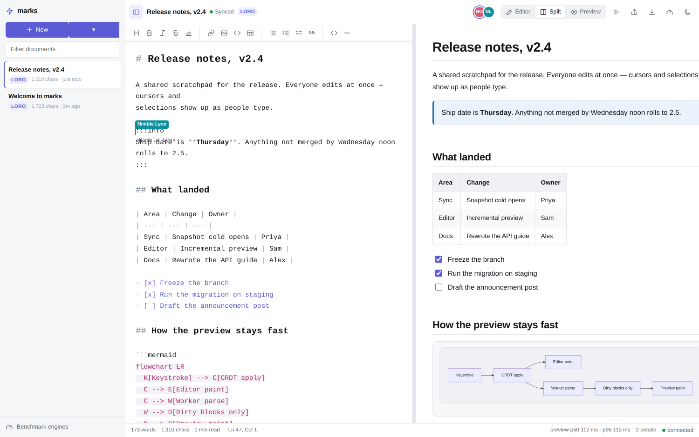
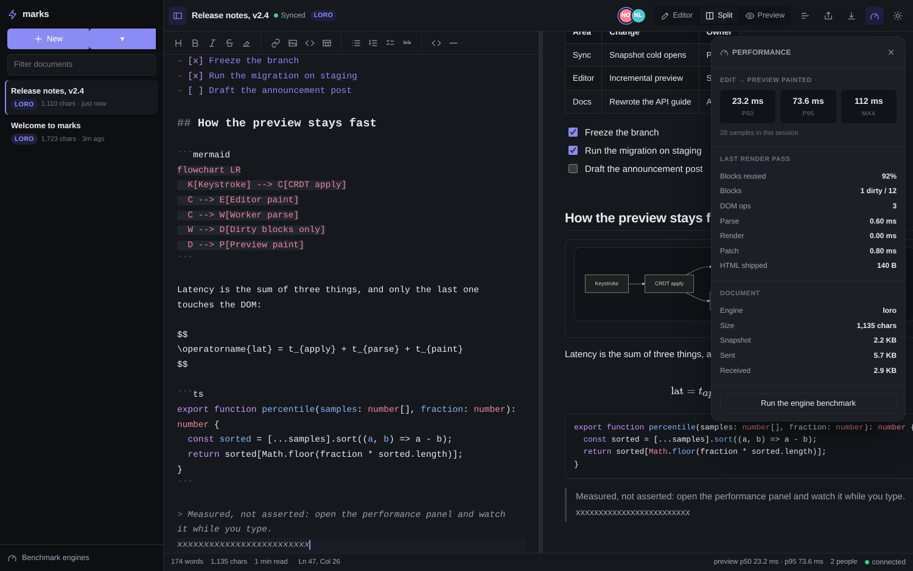

<a href="https://marks.secure.build"></a>

[not ready for production // do not use ]
# marks

Collaborative Markdown editing designed to stay responsive on large documents.

A full document workspace — source on the left, live preview on the right, and
a Word-like command ribbon around it — where every keystroke lands in a local
session first and the preview repaints only the blocks you actually changed.


## the best (only?) collaborative markdown editor

Most markdown editors debounce the preview and re-render the whole document.
That is fine for a page of notes and miserable for a long one. marks takes the
work apart:

| | Typical markdown editor | marks |
| --- | --- | --- |
| Preview | debounce, then re-render everything | per-block content hash, only dirty blocks repaint |
| Parsing | on the main thread, blocking input | in a Web Worker; dirty source blocks only |
| Off-screen content | laid out and painted | skipped via `content-visibility` |
| Merging | operational transform, server-ordered | CRDT, converges without a server |
| Opening a document | replay the edit history | one snapshot over cacheable HTTP |
| Performance claims | none | a panel in the app, and a benchmark you can run |

The result on a 53 KB, 757-block document, typing in the middle of it:

```
edit → preview painted     p50 55 ms · p95 114 ms
blocks re-rendered         1 of 757
DOM operations             3
```

Typing itself never waits on any of that — the editor and the CRDT are on the
main thread, the markdown parser is not.

## Running it

```bash
npm install
npm run dev          # browser client on :5173
cargo test --workspace
cargo run -p marks-server   # Rust API/room server on :3000
```

The complete UI runs in local workspace mode by default: documents, templates,
editing, preview, comments, history, dialogs, preferences, and exports work
without a server. Local mode is a real Rust/Wasm ESBT replica with an
IndexedDB journal, not a string buffer. The Vite client proxies `/v1` and
`/collab` to `MARKS_SERVER`, where `marks-server` serves the identity,
document, and room APIs on the same encodings the browser emits. The browser
artifact builds with:

```bash
npm run build
npm run preview      # static preview only; no API or collaboration backend
```

### Environment

| Variable | Default | Purpose |
| --- | --- | --- |
| `MARKS_SERVER` | `http://localhost:3000` | Rust API/WebSocket target used by the Vite development proxy |
| `VITE_MARKS_DATA_MODE` | `local` | Set to `service` when building against a runnable document service |
| `VITE_MARKS_RIBBON_WILD` | unset (disabled) | Set to `1` at build time to activate the ribbon possibility layer |

`marks-server` reads its own environment (`MARKS_LISTEN`, `MARKS_DB`,
`MARKS_ORIGIN`, `MARKS_STATIC_DIR`, `MARKS_EVT_ENABLED`); see
[crates/marks-server/README.md](crates/marks-server/README.md). The
`https://marks.secure.build` deploy (Caddy, systemd backoff, Knot) is in
[deploy/](deploy/).

## Editing

Everything you would expect from a markdown editor, plus what HackMD taught
people to expect:

- **Split, editor-only and preview-only** modes (`Ctrl`/`Cmd` + `\` cycles them)
- **Synchronised scrolling** mapped by source line, not by percentage
- **Formatting toolbar** and shortcuts — bold, italic, strikethrough, highlight,
  headings, links, lists, task lists, quotes, tables, code blocks
- **Adaptive command ribbon** — File, Home, Insert, Draw, AI, Review, and View
  decks plus contextual Picture / Table / Shape tools; 3D folded-glass glyphs;
  a phone composer and a hinge-aware foldable companion instead of squeezed
  breakpoints
- **Local comments and version history** — complete interaction scaffolding
  behind replaceable review/session adapters
- **Live outline** built from the document's headings (`Ctrl`/`Cmd` + `Shift` + `O`)
- **Clickable task lists** — ticking a box in the preview edits the source
- **Tables, footnotes, definition lists, abbreviations, sub/sup, marks, emoji**
- **Math** via KaTeX, **diagrams** via Mermaid, **syntax highlighting** via highlight.js
- **Callouts** — `:::info`, `:::success`, `:::warning`, `:::danger`, `:::note`
- **Presence (delivered baseline)**: ephemeral per-tab avatars plus remote
  source cursors/selections. Authenticated multi-tab aggregation, activity
  states, anchored V2 frames, and preview-follow modes are planned, not shipped;
  see the [presence contract](docs/PRESENCE.md).
- **Per-user undo** — undoing reverts your edits, never a collaborator's
- **Offline editing**, with local persistence, multi-tab replica sync, and automatic resync
- **Voice input** where the browser exposes SpeechRecognition
- **Document-scoped copy / paste / select-all / right-click**, including HTML→markdown paste
- **Light/dark themes, compact density, reduced glass and reduced motion**, with
  explicit phone, foldable, tablet, and desktop postures
- **Export** to `.md`; the Rust server will add revocable,
  permission-checked share links

## Architecture

```
client/                     Vite + React + TypeScript
  auth/                     scratch/device primitives and room admission
  data/                     one document adapter; local workspace or Rust /v1
  browser/                  clipboard, context menu, voice, tab sync, cache
  collab/                   CollabSession, Wasm ESBT document, journal,
                            presence decorations for CodeMirror
  markdown/                 markdown-it setup, incremental block parse, DOM patch
  workers/                  markdown.worker.ts, bench.worker.ts
  public/esbt.wasm          Rust core + embedded, generated ABI contract
  editor/                   CodeMirror 6 setup, commands, theme
  pages/                    route screens: Home, Benchmark
  content/                  canonical documents (About opens in the editor)
  components/shell/         app frame: titlebar, sidebar, dock
  components/chrome/        Word-inspired ribbon, phone composer
  components/workspace/     editor, preview, outline, status
  components/overlays/      dialogs, toasts, context menu, HUD
  components/identity/      keep-workspace and account sheets
  components/glyphs/        3D folded-glass command icons
  components/ui/            primitives: mark, icons, modal, glass host
engine-profile.json         shared native/Wasm resource and compaction policy
crates/marks-auth/          identity/authorization validators
crates/marks-server/        the only HTTP/WebSocket process
```

Rebuild the Wasm artifact and generated TypeScript binding from the pinned
ESBT-web revision with `scripts/build-esbt-wasm.sh`; verify its revision,
content hashes, embedded ABI, import surface, and export signatures with
`npm run verify:esbt`.

`marks-server` is one Rust process owning HTTP, sessions, ACLs, durable
document rooms, and the native ESBT replica (the pinned
[maceip/ESBT-web](https://github.com/maceip/ESBT-web) core). There is
intentionally no Node server or compatibility layer: room payloads are the
Rust core's canonical `ESBM`/`ESBS`/`ESBF` encodings, which the browser
speaks through the same core compiled to Wasm.

### The rendering path

1. A keystroke applies to the local CRDT replica and paints in CodeMirror. No
   network, no worker, no wait.
2. Exact UTF-16 edit ranges go to the markdown worker; the main thread does not
   serialize the whole document on every keystroke. A one-paragraph edit
   tokenizes only the dirty source block. Link references, footnotes,
   abbreviations, and heading-slug collisions still force a full document
   parse, because those are document-wide.
3. The worker returns HTML **only for blocks the main thread does not already
   have**. A one-word edit in a 700-block document ships a few hundred bytes.
4. The main thread sanitises those blocks and reconciles them into the DOM by
   key. Unchanged blocks keep their exact nodes, so their layout, their rendered
   diagrams and any text selection inside them survive.

Block keys are content hashes plus an occurrence counter, so inserting a
paragraph at the top of a document does not invalidate everything below it.

### The CRDT engine

Documents are stored in **ESBT** (Mechaoui & Imine,
[arXiv:2607.28101](https://arxiv.org/abs/2607.28101)), a sequence CRDT that
orders characters by weighted identifiers — Stern–Brocot fractions with an
integer ladder and a sequence path behind them — so deletes remove state
instead of leaving tombstones. The browser runs the Rust core through the
`esbt_doc_*` Wasm ABI (`client/src/collab/wasm`), the same crate
`marks-server` uses natively. Per-replica undo, transaction batching, and an
IndexedDB full-snapshot + update journal live on the Marks side of that
boundary; the engine does not schedule its own compaction or persistence.
Transient presence is a small Marks-owned, bounded, non-persistent protocol;
there is no second TypeScript document engine. Comments and version history
are fully usable in local mode. Remote
comment storage, commenter authorization, and cross-user history are still
absent until the authenticated metadata service lands. The binding and release
boundary is [docs/V1-SCOPE.md](docs/V1-SCOPE.md).

Presence is intentionally outside durable sync. Its delivered V1 offset path,
defined degraded behavior, planned V2 anchor path, privacy invariants, and
reader-first rollout are tracked separately in [docs/PRESENCE.md](docs/PRESENCE.md);
the avatar/cursor bullet above must not be read as claiming those planned
semantics.

**Engine performance receipt** in the sidebar runs the checked-in Rust/Wasm
artifact in a worker. Interactive operations are one transaction and one
update each; offline branch work is explicitly batched. One warm-up is
discarded, 3–5 trials are recorded, and the page reports median/p95 plus raw
samples, artifact/source/ABI hashes, seed, browser, memory, and encoded bytes.
It deliberately makes no cross-engine claim. Download the JSON receipt if a
number will be cited; a screenshot or an unpinned one-off result is not
benchmark evidence.

### Sync protocol

The room transport is the tag-byte framing in `client/src/collab/protocol.ts`
(`MSG_UPDATE`, `MSG_EPHEMERAL`, `MSG_SERVER_VV`, `MSG_SNAPSHOT`, `MSG_SYNCED`,
`MSG_MUTATION`, `MSG_COMMITTED`)
carrying the Rust core's canonical, versioned, bounded encodings — the same
bytes the Wasm client emits. Admission is a one-use ticket in
`Sec-WebSocket-Protocol` that binds an exact
principal/session/device/document/site/role (or scratch/document/site) actor.
The room validates role policy before decoding CRDT bytes, applies valid
mutations to a staged replica, group-commits consecutive mutations and their
stable 128-bit retry receipts in one FULL-synchronous SQLite transaction, and
only then acknowledges and broadcasts each independent revision. Retrying the
same ID and bytes returns its original committed receipt; rebinding an ID is a
protocol error. The browser says “saving” until that receipt atomically
checkpoints IndexedDB and removes the matching retry. When a replica has
compacted past a peer's version it sends a compact snapshot instead of a delta
(`HistoryUnavailable`).

## Performance panel

`Ctrl`/`Cmd` + `Shift` + `M` opens a live readout: edit-to-paint p50/p95/max,
how many blocks were dirty on the last pass, whether that parse was
incremental or full, how many DOM operations that cost, parse and render time,
bytes on the wire, retained/pending operations, current Dmax, last update
size, IndexedDB journal saved-ness, and the encoded size of the document.



## Tests

```bash
npm run verify:esbt      # strict artifact revision/hash/ABI/provenance gate
npm run test:bench       # deterministic trace and median/p95 receipt policy
npm run test:browser     # clipboard, context-menu, select-all, tab isolation
npm run test:markdown    # document-global preview invalidation and incremental parse
npm run test:wasm        # Wasm adapter, site conversion, journal, reconnect fallbacks
npm run test:auth        # browser/Rust canonical auth wire and scratch helpers
npm run test:harness     # helper units only: chrome discovery, budget parsers, wait-for-server
cargo test --workspace   # marks-auth validators plus marks-server HTTP/room integration
npm run check:ui-budgets # gzip critical-path budgets after npm run build
npm run harness:probe    # print Playwright / Puppeteer / agent-browser + Chrome paths
npm run ci:service       # current service UI plus native second-peer proof
npm run smoke:platforms  # portable glass checks on Playwright, Puppeteer, agent-browser
npm run measure          # latency on a large generated document
```

GitHub Actions (`.github/workflows/ci.yml`) has two required jobs on the Rust
version in `rust-toolchain.toml` (the same pin as
`workspace.package.rust-version`):

- `test` — format, clippy, workspace tests (including in-process
  `room_collab`), strict Wasm identity/ABI verification, Node unit suites
  including `test:wasm`, and the default local client build.
- `service-collab` — builds `marks-server` plus `VITE_MARKS_DATA_MODE=service`,
  boots the binary, drives first-paint `/v1` from Playwright, then runs two
  native ESBT peers against the UI-created document (`npm run ci:service`).

A green workflow is proof of service-mode admission, native multi-peer room
convergence, and the Wasm client plumbing tests. It is not a two-live-browser
paint test. The separate `scheduled-service-smoke.yml` workflow runs daily,
manually, and whenever its own contract changes: it builds the release-shaped
service client/server, repeats the Chromium service/native-peer proof, then
enforces large-document first-render, p50/p95, dirty-block, and DOM-operation
budgets.

The old `npm run smoke` program is retained for its interaction scenarios, but
its independent-browser-context sharing path predates the current scratch and
session admission boundary and is not an admitted service acceptance suite.
Use `npm run ci:service` for current service evidence.

`npm run smoke:platforms` runs the same document-glass checks (rendering,
select-all, context menu, honest voice availability, theme, and connectivity
copy) on all three local platforms. How each platform is found, and which Chrome binary they
launch, is in [docs/TEST-HARNESS.md](docs/TEST-HARNESS.md).

The portable surface suite can run against the default local Vite app. The
current connected service proof needs a service-mode build and an independently
running Rust server binary:

```bash
VITE_MARKS_DATA_MODE=service VITE_MARKS_TEST_SERVICE_WORKER=1 npm run build
cargo build -p marks-server
MARKS_TEST_SERVICE_WORKER=1 npm run ci:service -- --bin target/debug/marks-server --static-dir client/dist --browser chromium
```


## Known limits

- A first preview pass, or an edit that changes link references, footnotes,
  abbreviations, or heading slugs, still tokenizes the whole document. Ordinary
  paragraph and fence edits use incremental block-level parsing.
- Encoded identifier *paths* still grow with concurrent middle-insertion
  churn; format v3 already front-codes and dictionary-codes update payloads,
  which is the compact encoding the paper called future work. Further
  identifier compression remains engine research, not a Marks wiring gap.
- Local mode is a real Wasm replica with an IndexedDB journal. Service-mode
  admission and native multi-peer rooms are proven in the `service-collab`
  CI job. A two-live-browser service proof with independently authorized
  browser contexts remains a separate acceptance gap; the retained pre-auth
  `npm run smoke` path does not satisfy it.

## Built on

[ESBT](https://github.com/maceip/ESBT-web) (Mechaoui & Imine,
[arXiv:2607.28101](https://arxiv.org/abs/2607.28101)) ·
[CodeMirror 6](https://codemirror.net) ·
[markdown-it](https://github.com/markdown-it/markdown-it) · [KaTeX](https://katex.org) ·
[Mermaid](https://mermaid.js.org) · [highlight.js](https://highlightjs.org) ·
[DOMPurify](https://github.com/cure53/DOMPurify) · [React](https://react.dev) ·
[Vite](https://vite.dev) · [Rust](https://www.rust-lang.org/)

The research behind the CRDT choices, with papers and implementations from
January 2025 to August 2026, is in [docs/RESEARCH.md](docs/RESEARCH.md). The
browser-surface review — right-click, clipboard, voice, caching,
multi-tab, slow/offline — is in [docs/BROWSER-SURFACE.md](docs/BROWSER-SURFACE.md).
The UI presentation contract is [docs/UI-SURFACE.md](docs/UI-SURFACE.md). The
HTTP, cookie, and room-admission interfaces the frontend must implement
against `marks-server` are in
[docs/UI-SERVICE-CONTRACT.md](docs/UI-SERVICE-CONTRACT.md). How the browser
owns ESBT configuration, compaction, journaling, and reconnect is
[docs/CLIENT-PLUMBING.md](docs/CLIENT-PLUMBING.md).
